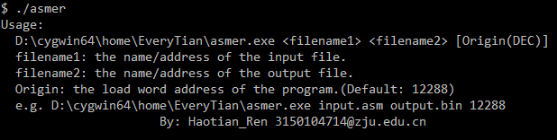
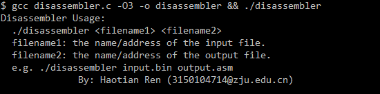

# MIPS-Assembler
An assembler and a disassembler for a subset of MIPS.

### Supported Instructions:

```
*R
add     rd, rs, rt  10 0000 0x20
addu    rd, rs, rt  10 0001 0x21
and     rd, rs, rt  10 0100 0x24
break               00 1101 0x0D
div         rs, rt  01 1010 0x1A
divu        rs, rt  01 1011 0x1B
jalr    rd, rs      00 1001 0x09
jr          rs      00 1000 0x08
mfhi    rd          01 0000 0x10
mflo    rd          01 0010 0x12
mthi        rs      01 0001 0x11
mtlo        rs      01 0011 0x13
mult        rs, rt  01 1000 0x18
multu       rs, rt  01 1001 0x19
nor     rd, rs, rt  10 0111 0x27
or      rd, rs, rt  10 0101 0x25
sll     rd, rt, sa  00 0000 0x00
sllv    rd, rt, rs  00 0100 0x04
slt     rd, rs, rt  10 1010 0x2A
sltu    rd, rs, rt  10 1011 0x2B
sra     rd, rt, sa  00 0011 0x03
srav    rd, rt, rs  00 0111 0x07
srl     rd, rt, sa  00 0010 0x02
srlv    rd, rt, rs  00 0110 0x06
sub     rd, rs, rt  10 0010 0x22
subu    rd, rs, rt  10 0011 0x23
syscall             00 1100 0x0C
xor     rd, rs, rt  10 0110 0x26

*I
addi    rt, rs, immediate   00 1000 0x08
addiu   rt, rs, immediate   00 1001 0x09
andi    rt, rs, immediate   00 1100 0x0C
beq     rs, rt, label       00 0100 0x04
bgez    rs, label           00 0001 0x01  rt = 00001
bgtz    rs, label           00 0111 0x07  rt = 00000
blez    rs, label           00 0110 0x06  rt = 00000
bltz    rs, label           00 0001 0x01  rt = 00000
bne     rs, rt, label       00 0101 0x05
lb      rt, immediate(rs)   10 0000 0x20
lbu     rt, immediate(rs)   10 0100 0x24
lh      rt, immediate(rs)   10 0001 0x21
lhu     rt, immediate(rs)   10 0101 0x25
lui     rt, immediate       00 1111 0x0F
lw      rt, immediate(rs)   10 0011 0x23
lwc1    rt, immediate(rs)   11 0001 0x31
ori     rt, rs, immediate   00 1101 0x0D
sb      rt, immediate(rs)   10 1000 0x28
slti    rt, rs, immediate   00 1010 0x0A
sltiu   rt, rs, immediate   00 1011 0x0B
sh      rt, immediate(rs)   10 1001 0x29
sw      rt, immediate(rs)   10 1011 0x2B
swc1    rt, immediate(rs)   11 1001 0x39
xori    rt, rs, immediate   00 1110 0x0E

*J
j   label   000010  coded address of label 0x02
jal label   000011  coded address of label 0x03
```

### Help Information

- Assembler:

  

- Disassembler:

  


[**See more (In Chinese)**](MIPS_(Dis)Assembler_Instructions.pdf) 